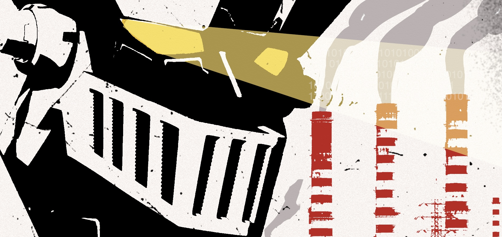
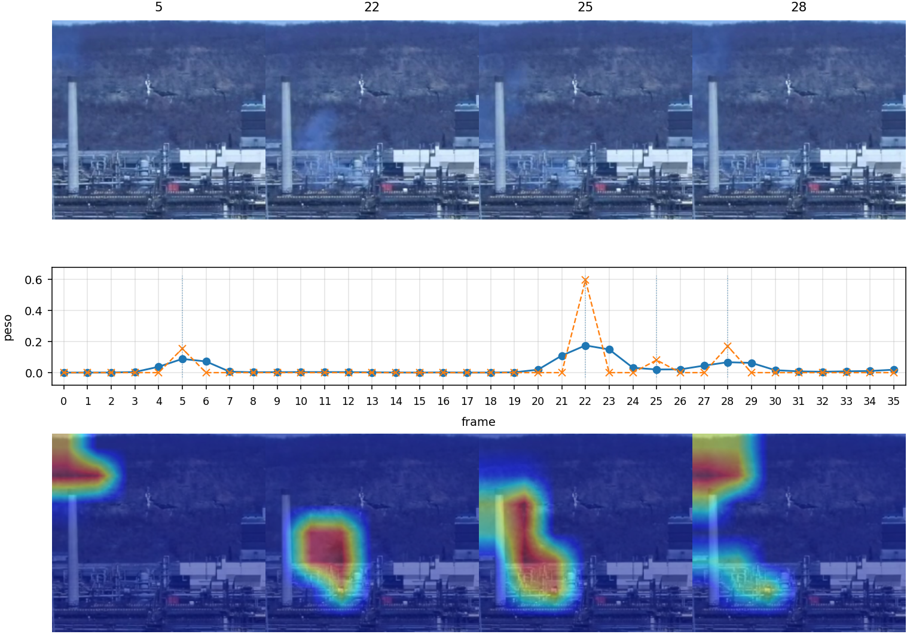
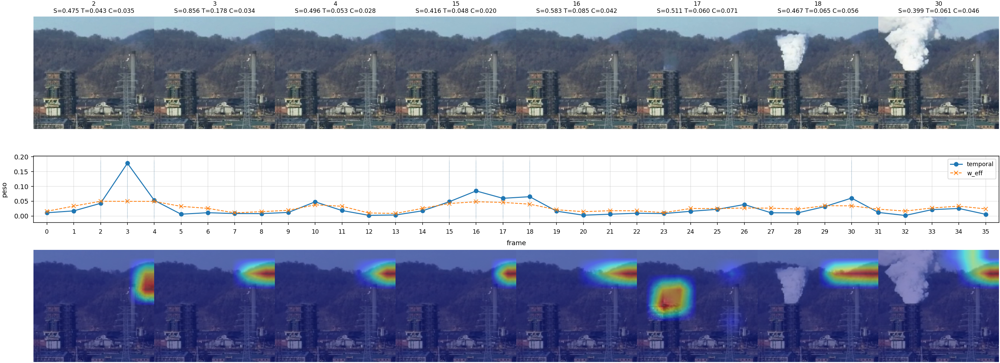
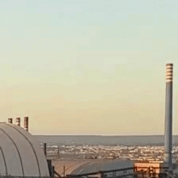
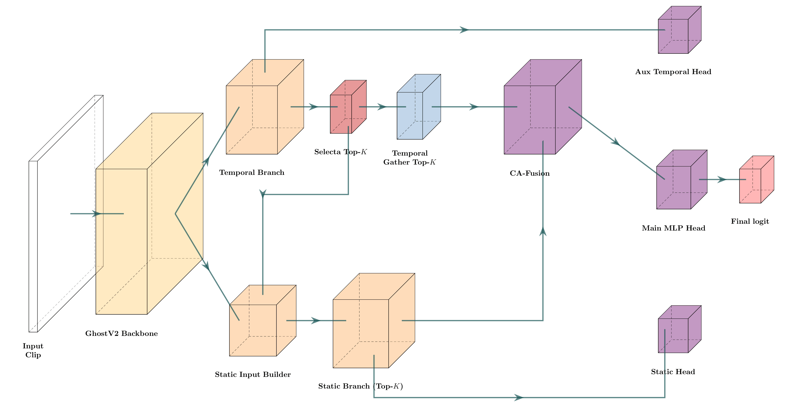
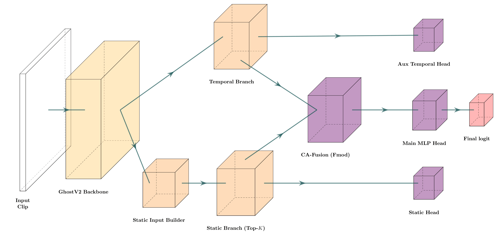

# MazingaSmokeClassifier: Deep Learning for Industrial Smoke Emission Classification

MazingaSmokeClassifier is a university project on industrial smoke classification based on deep learning and computer vision.

This repository contains two main model versions, **MazingaSmokeClassifier_v1** and **MazingaSmokeClassifier_v2**, together with the code used for training, qualitative analysis, and fine-tuning experiments.

The project is mainly developed on the **RISE** dataset and includes additional experiments on a custom dataset collected in the industrial area of Taranto, referred to as **ILVA** in this repository.

The code is released under the BSD 3-Clause License, while the ILVA dataset is released under the CC0 1.0 Universal license.

<p align="left">
  
</p>

## Overview

The repository includes:
- results on RISE
- the **ILVA** dataset
- two main model variants (**v1** and **v2**)
- training and fine-tuning code for domain shift experiments from **RISE** to **ILVA**
- pretrained model weights
- RISE relabeling patch

## Results on RISE

**MazingaSmokeClassifier_v2** reaches an average **F1-score of 0.887**, staying only **0.006 below the best model** in the comparison (**STENet, 8 frames, Avg F1 = 0.893**), while using only **1.9M parameters**, the **lowest number of parameters among all compared methods**.

### Performance comparison on the six RISE splits

| Model | Params | S0 | S1 | S2 | S3 | S4 | S5 | Avg F1 |
|---|---:|---:|---:|---:|---:|---:|---:|---:|
| RGB-I3D-TC | 12.3M | 0.81 | 0.84 | 0.84 | 0.87 | 0.81 | 0.77 | 0.823 |
| STCNet (8 frames, MobileNetV2) | 3.7M | 0.86 | 0.88 | 0.87 | 0.89 | 0.84 | 0.86 | 0.868 |
| STCNet (8 frames, SE-ResNeXt-50) | 27.2M | 0.88 | 0.89 | 0.90 | 0.90 | 0.86 | 0.88 | 0.885 |
| STENet (4 frames) | 6.9M | 0.90 | 0.88 | 0.89 | 0.90 | 0.84 | 0.88 | 0.882 |
| STENet (6 frames) | 6.9M | 0.90 | 0.89 | 0.90 | 0.91 | 0.85 | 0.88 | 0.887 |
| STENet (8 frames) | 6.9M | 0.90 | 0.89 | 0.90 | 0.91 | 0.86 | 0.89 | 0.893 |
| **MazingaSmokeClassifier_v1** | **1.9M** | **0.86** | **0.88** | **0.89** | **0.92** | **0.84** | **0.84** | **0.872** |
| **MazingaSmokeClassifier_v2** | **1.9M** | **0.87** | **0.90** | **0.90** | **0.93** | **0.86** | **0.86** | **0.887** |

A particularly relevant result is that **MazingaSmokeClassifier_v2** achieves the **best score on split S1 (0.90)** together with the **highest score in the whole table on split S3 (0.93)**. **MazingaSmokeClassifier_v1** is also very competitive on S3, reaching **0.92**. 

### Model complexity comparison

| Model | Params | FLOPs | Latency | Throughput |
|---|---:|---:|---:|---:|
| **MazingaSmokeClassifier_v1** | **1.9M** | **10.3G** | **23.8 ms** | **41.9 clip/s** |
| **MazingaSmokeClassifier_v2** | **1.9M** | **12.3G** | **24.6 ms** | **40.6 clip/s** |

From **v1** to **v2**, the average F1-score improves from **0.872** to **0.887** with the **same number of parameters**, while the computational increase remains limited: FLOPs rise from **10.3G** to **12.3G**, and latency increases by only about **0.8 ms**.

## What the models see

To provide qualitative evidence that the models focus on smoke rather than on background or lighting changes, the following examples show Grad-CAM visualizations and attention distributions. In the plots, the blue line represents the attention weights of the temporal branch, while the orange line represents the attention weights of the fusion module.

### Example 1: true positive (MazingaSmokeClassifier_v1)

In this example, no particularly strong distractors are present.  
MazingaSmokeClassifier_v1 follows the smoke plume coherently across the clip and concentrates the activation on the correct region.

<p align="left">
  
</p>

### Example 2: true positive with steam (MazingaSmokeClassifier_v2)
In frame 17, the model highlights an area that later appears as steam, likely because at that moment it still looks like smoke. In the following frames, the steam is successfully ignored.


<p align="left">
  
</p>

## The ILVA dataset

<table>
  <tr>
    <td width="400" valign="top">
      
    </td>
    <td valign="top">
      <p>
        The <strong>ILVA</strong> dataset is a small dataset collected in the industrial area of <strong>Taranto</strong>, in Southern Italy, around the <strong>EX-ILVA</strong> steel plant, the largest steelworks in Europe. It was introduced to evaluate how models trained on <strong>RISE</strong> behave in a different target domain. Some of the recordings also include views of the <strong>ENI refinery</strong> in Taranto.
      </p>
      <p>
        The recordings were made using a smartphone mounted on a tripod and were collected from multiple viewpoints in the area between <strong>Statte</strong> and the <strong>Tamburi</strong> district of Taranto, with the goal of building fixed-camera timelapse clips in a setting as close as possible to the RISE scenario. This introduces substantial visual variability across the dataset, including different distances, framing conditions, atmospheric effects, and industrial backgrounds.
      </p>
      <p>
        The dataset was constructed as follows:
      </p>
      <ul>
        <li>timelapse acquisition with <strong>1 frame every 10 seconds</strong>,</li>
        <li>original capture at about <strong>4K resolution (3840×2160)</strong>,</li>
        <li>manual reconstruction of timelapse sequences from extracted frames,</li>
        <li>spatial cropping (<strong>320×320</strong>) around the regions of interest,</li>
        <li>construction of clips of <strong>36 frames</strong>,</li>
        <li>generation of a new clip every <strong>18 frames</strong>, introducing overlap between consecutive clips.</li>
      </ul>
      <p>
        The clips released in this repository are provided directly at <strong>224×224</strong> resolution.
      </p>
      <p>
        The dataset contains <strong>463 clips</strong>, of which <strong>51 are positive</strong>. Positive events are relatively rare and, in most cases, visually weak, low-density, and sometimes barely perceptible. In addition, the examples collected from the <strong>ENI refinery</strong> did not contain positive events, so the positive clips effectively come from the <strong>ex-ILVA</strong> area.
      </p>
    </td>
  </tr>
</table>

### Split used for fine-tuning and evaluation

| Split | Total samples | Positive samples | Positive ratio | “Sky” clips |
|---|---:|---:|---:|---:|
| Training | 321 | 28 | 8.7% | 108 |
| Validation | 71 | 10 | 14.1% | 0 |
| Test | 71 | 13 | 18.3% | 0 |

The splits were constructed so that the same views do not appear in different subsets. The training split also includes **108 “sky” clips**, i.e. clips containing only the sky in different lighting conditions. 

<p align="left">
  
  
  
  
  

</p>

## Results on ILVA

Despite the strong domain shift from **RISE** to **ILVA**, both **MazingaSmokeClassifier_v1** and **MazingaSmokeClassifier_v2** make only **3 errors out of 71 clips** on the **ILVA** test set, all of them corresponding to **false negatives**. The two models miss the same clips.

In 2 of the 3 missed cases, the smoke is extremely faint and difficult to distinguish even for a human observer; in the remaining case, the emission is still visible but weak.  

## Model overview

MazingaSmokeClassifier is a lightweight spatio-temporal model for binary classification of industrial smoke emissions in video clips.

The architecture was developed on the **RISE** dataset, the main public dataset for industrial smoke classification. The design takes inspiration from previous spatio-temporal approaches proposed for the same task.

The model takes as input **RISE video clips**. In the reference setting adopted in this repository, clips are built from the **320×320** RISE version and resized to **224×224** before being processed by the network.

Two main variants are currently included:
- **MazingaSmokeClassifier_v1**, the first stable version,
- **MazingaSmokeClassifier_v2**, a later variant introduced to simplify the pipeline while keeping the same general design rationale.

### MazingaSmokeClassifier_v1

MazingaSmokeClassifier_v1 is the first stable version of the architecture.

The model takes as input a clip of 36 RGB frames resized to **224×224** and first extracts frame-level features through a **GhostNetV2** backbone. From these features, the network splits into two complementary paths: a **temporal branch**, which models the evolution of the clip over time, and a **static branch**, which focuses on spatial appearance on a small subset of relevant frames.  

The key idea of **v1** is to avoid processing all frames in the static path. Instead, the temporal branch identifies a small set of informative and non-redundant frames through the **Selecta** module. In the reference configuration used in this repository, **K = 4** frames are selected, with a **suppression radius of 2**, in order to encourage temporal diversity and reduce redundancy among neighboring frames.

Once the top-K frames have been selected, the model builds a static input from those frames and extracts spatial features only on that subset. It then combines static and temporal information through a **cross-attention fusion** module. 

The static branch also incorporates **CEPool** and **CEConv**, inspired by the design proposed in **CENet**, to mitigate the limitations of standard pooling and convolution operations and better preserve informative channel-wise feature patterns. In this repository, these modules were independently implemented from the paper description.  

During training, the architecture uses **three prediction heads**: one **main MLP head** after the fusion module, one **auxiliary temporal head**, and one **auxiliary static head**. The auxiliary heads are used only to support supervision and gradient propagation during training. During inference, the final prediction is produced only by the **main fusion head**.


<p align="left">
  
</p>

### MazingaSmokeClassifier_v2

MazingaSmokeClassifier_v2 is a later full-frame alternative derived from the previous design.

Starting from the same general backbone-temporal-static organization, **v2** removes the discrete Top-K frame selection used in v1 and explores a simpler configuration that does not rely on an explicit sparse frame selection stage. The model still combines temporal and static information, but with a modified fusion setting adapted to this variant.

<p align="left">
  
</p>


## Training and fine-tuning

Training is built on top of the original **RISE** pipeline, keeping the same structure for data loading, augmentation, training/validation loops, and metric logging.

The training code includes:
- RGB clip preprocessing and normalization
- data augmentation
- **balanced focal loss**
- **soft relabeling** to mitigate uncertain annotations
- **MixUp**
- **multi-head supervision** with one main head and auxiliary heads
- **AdamW** optimization with learning-rate scheduling
- **Lookahead**, warmup, cosine decay, and checkpoint resume

For fine-tuning on **ILVA**, the main differences are:

- learning rates are manually reduced 
- the backbone is partially frozen, keeping only the last stage trainable
- batches are mixed across **RISE** and **ILVA**
- ILVA positives are oversampled through a **WeightedRandomSampler** with replacement
- the model returns an additional fused feature representation used for **D-CORAL** domain alignment
- a milder version of **Focal Loss** is used during fine-tuning
- **MixUp** and **bootstrap relabeling** are disabled
- warmup is disabled

The fine-tuning setup is designed to make domain adaptation on ILVA in the presence of few positive samples, strong domain shift, and visually ambiguous events.

## Available checkpoints and results

The repository includes pretrained checkpoints and experiment outputs for both model variants.

- `weights_v1/` and `weights_v2/` store the pretrained model weights for **MazingaSmokeClassifier_v1** and **MazingaSmokeClassifier_v2**.
- `runs_test_v1/` and `runs_test_v2/` store the inference outputs obtained on the **RISE** test splits.
- `finetune_ilva_v1/` and `finetune_ilva_v2/` store the **ILVA fine-tuning** experiments, including both training runs and final results.

## RISE relabeling patch

This repository also includes a relabeling patch for the RISE dataset, introduced to mitigate annotation errors and ambiguities in the original data.

After developing and testing the first models, I observed that part of the false positives and false negatives did not really depend on the model itself, but on labels that were likely wrong or highly ambiguous. In a task like industrial smoke classification, where smoke, steam, and weather effects can look very similar, a certain amount of label noise is plausible even for human supervision.

To reduce this effect, after completing the original [RISE tutorial](http://smoke.createlab.org) and following the labeling guidelines provided by the authors, I used the models to identify the most suspicious cases and manually re-examined about 2,000 clips.

Overall, 1,477 annotations were modified:
- 891 with a change in weight only,
- 145 with a change in label only,
- 441 with a change in both label and weight.

This patch should be understood as an attempt to mitigate annotation noise, not as a definitive correction of the dataset.

## Third-party code 

This repository includes code adapted from the project
[CMU-CREATE-Lab/deep-smoke-machine](https://github.com/CMU-CREATE-Lab/deep-smoke-machine).

The static branch also draws inspiration from the CEPool and CEConv modules introduced in CENet. 
[CENet: A Channel-Enhanced Spatiotemporal Network With Sufficient Supervision Information for Recognizing Industrial Smoke Emissions](https://ieeexplore.ieee.org/document/9741308)

## Citation
If you use this repository, please cite this work as:

```bibtex
@thesis{verde2026mazingasmoke,
  author       = {Daniele Verde},
  title        = {MazingaSmokeClassifier: Deep Learning e visione artificiale per il rilevamento di fumi industriali},
  school       = {Sapienza Università di Roma},
  year         = {2026},
  note         = {Relazione di tirocinio}
}
