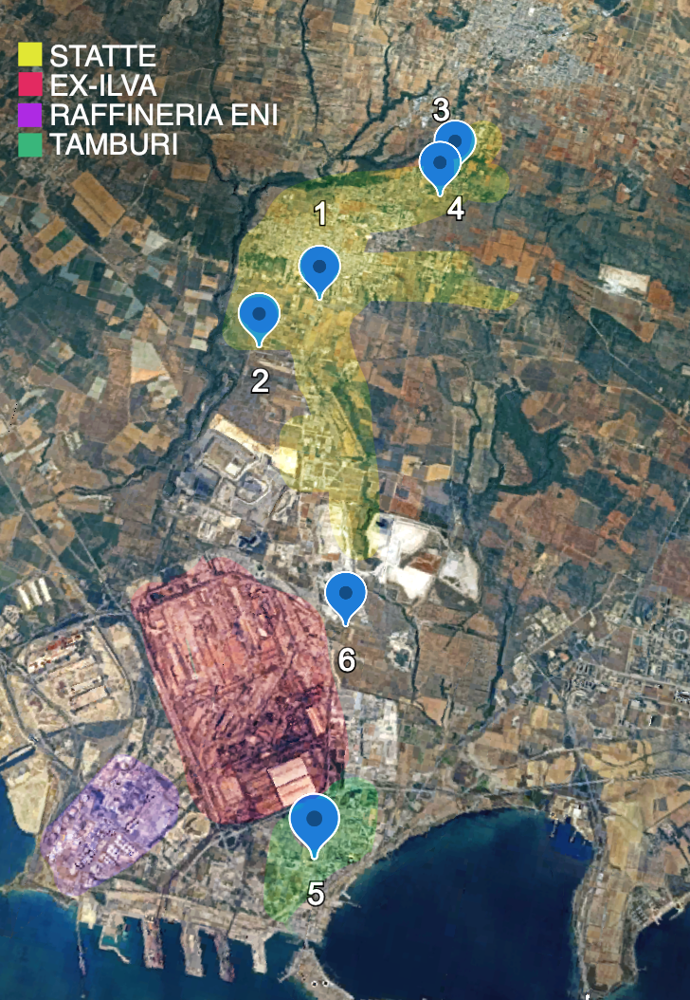
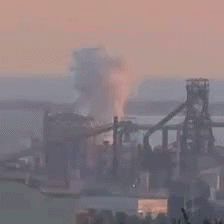
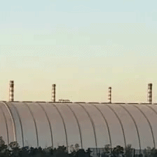
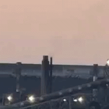
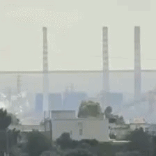

## The ILVA dataset

<table>
  <tr>
    <td width="400" valign="top">
      
    </td>
    <td valign="top">
      

        The <strong>ILVA</strong> dataset is a small dataset collected in the industrial area of <strong>Taranto</strong>, in Southern Italy, around the <strong>EX-ILVA</strong> steel plant, the largest steelworks in Europe. It was introduced to evaluate how models trained on <strong>RISE</strong> behave in a different target domain. Some of the recordings also include views of the <strong>ENI refinery</strong> in Taranto.
      

      

        The recordings were made using a smartphone mounted on a tripod and were collected from multiple viewpoints in the area between <strong>Statte</strong> and the <strong>Tamburi</strong> district of Taranto, with the goal of building fixed-camera timelapse clips in a setting as close as possible to the RISE scenario. This introduces substantial visual variability across the dataset, including different distances, framing conditions, atmospheric effects, and industrial backgrounds.
      

      

        The dataset was constructed as follows:
      

      <ul>
        <li>timelapse acquisition with <strong>1 frame every 10 seconds</strong>,</li>
        <li>original capture at about <strong>4K resolution (3840×2160)</strong>,</li>
        <li>manual reconstruction of timelapse sequences from extracted frames,</li>
        <li>spatial cropping (<strong>320×320</strong>) around the regions of interest,</li>
        <li>construction of clips of <strong>36 frames</strong>,</li>
        <li>generation of a new clip every <strong>18 frames</strong>, introducing overlap between consecutive clips.</li>
      </ul>
      

        The clips released in this repository are provided directly at <strong>224×224</strong> resolution.
      

      

        The dataset contains <strong>463 clips</strong>, of which <strong>51 are positive</strong>. Positive events are relatively rare and, in most cases, visually weak, low-density, and sometimes barely perceptible. In addition, the examples collected from the <strong>ENI refinery</strong> did not contain positive events, so the positive clips effectively come from the <strong>ex-ILVA</strong> area.
      

    </td>
  </tr>
</table>

### Split used for fine-tuning and evaluation

| Split | Total samples | Positive samples | Positive ratio | “Sky” clips |
|---|---:|---:|---:|---:|
| Training | 321 | 28 | 8.7% | 108 |
| Validation | 71 | 10 | 14.1% | 0 |
| Test | 71 | 13 | 18.3% | 0 |

The splits were constructed so that the same views do not appear in different subsets. The training split also includes **108 “sky” clips**, i.e. clips containing only the sky in different lighting conditions. 

  
  
  
  
  

